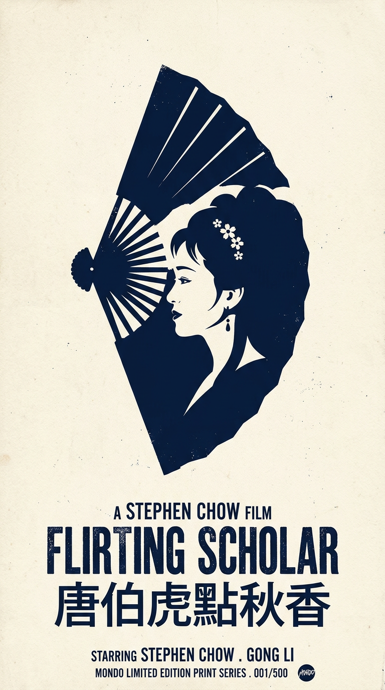

# Qiaomu Mondo Poster Design

English | [简体中文](README.md)

> **One Sentence, Master-Level Design** - No Photoshop, no color theory, no art history? No problem. Just describe what you want in one sentence, and AI automatically selects the perfect artistic style to generate professional-grade posters, covers, and designs.

**Powered by Google Gemini 3 Pro Image** 🎨

## 🚀 New in v3.0!

✨ **20 Legendary Artists** - From Saul Bass to Toulouse-Lautrec
🤖 **AI Auto-Style Selection** - Perfect match for any subject
📱 **Beginner-Friendly** - No design knowledge needed
🎨 **Versatile Formats** - Posters, book covers, social media graphics
🖼️ **Smart Features** - AI optimization, comparison, image-to-image

## Installation

```bash
npx skills add joeseesun/qiaomu-mondo-poster-design
```

## 📸 Gallery: Real Examples

### IMDB Top 10 Movie Posters

Created with various Mondo techniques:

| The Shawshank Redemption | The Godfather | The Dark Knight |
|:---:|:---:|:---:|
|  |  |  |
| *Negative space - Bird in bars* | *Minimalism - Puppet strings* | *Visual pun - Joker in bat* |

| The Godfather Part II | 12 Angry Men | Return of the King |
|:---:|:---:|:---:|
|  |  |  |
| *Dual timeline layering* | *12 hands & knife* | *Crown in flames* |

| Schindler's List | Fellowship of the Ring | Pulp Fiction |
|:---:|:---:|:---:|
|  |  |  |
| *Candle of hope* | *Map in ring* | *Briefcase mystery* |

### Master Technique: Figure-Ground Inversion

<p align="center">
  
  <br>
  <b>Flirting Scholar (唐伯虎点秋香)</b><br>
  <i>Female profile hidden in fan's negative space - Olly Moss technique</i>
</p>

## Quick Start

### Interactive with Claude Code

Simply say:
```
"Create Mondo poster for Blade Runner, compare styles"
"Design 1984 book cover in Saul Bass style"
"Jazz festival poster with vibrant colors"
```

### Command Line

```bash
# AI-enhanced generation
python3 ~/.claude/skills/qiaomu-mondo-poster-design/scripts/generate_mondo_enhanced.py "Blade Runner" movie --ai-enhance

# 3-style comparison
python3 ~/.claude/skills/qiaomu-mondo-poster-design/scripts/generate_mondo_enhanced.py "Akira" movie --compare kilian-eng,saul-bass,jock

# Custom colors
python3 ~/.claude/skills/qiaomu-mondo-poster-design/scripts/generate_mondo_enhanced.py "Jazz Night" event --style milton-glaser --colors "orange, purple, yellow"

# Image-to-image
python3 ~/.claude/skills/qiaomu-mondo-poster-design/scripts/generate_mondo_enhanced.py "noir" movie --input poster.jpg --style saul-bass

# List all styles
python3 ~/.claude/skills/qiaomu-mondo-poster-design/scripts/generate_mondo_enhanced.py --list-styles
```

## 🎨 20 Legendary Artists

**Belle Époque (1870s-1900s)**
- jules-cheret, toulouse-lautrec, alphonse-mucha, steinlen, eugène-grasset

**Modernist (1920s-1960s)**
- saul-bass, cassandre, milton-glaser, josef-muller-brockmann, paul-rand

**Film Legends**
- drew-struzan, olly-moss, tyler-stout, martin-ansin, laurent-durieux

**Contemporary**
- kilian-eng, dan-mccarthy, jock, shepard-fairey, jay-ryan, paula-scher

[See full artist guide →](references/artist-styles.md)

## ✨ Features

### AI Prompt Optimization
Enhances your idea while respecting the original intent
```bash
--ai-enhance
```

### 3-Column Comparison
Compare styles side-by-side
```bash
--compare saul-bass,olly-moss,jock
```

### Image-to-Image
Transform existing posters
```bash
--input poster.jpg
```

### Smart Colors
AI suggests or use your own
```bash
--colors "red, blue, cream"
```

## 📋 Mondo Aesthetic

1. **Artistic Reinterpretation** - Conceptual, not literal
2. **Screen Print** - 2-5 colors, flat blocks, halftone
3. **Minimalist Symbolism** - Props over faces
4. **Bold Typography** - Hand-drawn, Art Deco
5. **Retro Colors** - High saturation, bold contrasts

## 💻 Requirements

- Python 3.7+
- `requests` (required)
- `Pillow` (optional, for comparison/image-to-image)
- AI Gateway API Key as `AI_GATEWAY_API_KEY` env variable

```bash
pip install -r requirements.txt
```

## 📚 Documentation

- [SKILL.md](SKILL.md) - Full guide
- [Artist Styles](references/artist-styles.md) - 20 artists explained
- [Genre Templates](references/genre-templates.md) - Horror, sci-fi, etc.
- [Composition Patterns](references/composition-patterns.md) - Layout strategies

## 🤝 Contributing

Pull requests welcome! Share your Mondo creations.

## 📄 License

MIT

## 📱 Follow

- **X**: [@vista8](https://x.com/vista8)
- **WeChat**: 向阳乔木推荐看

<p align="center">
  
</p>

---

**Powered by [Claude Code](https://claude.com/claude-code) + Google Gemini 3 Pro Image** 🤖✨
