# 乔木 Mondo 海报设计 / Qiaomu Mondo Poster Design

[English](README.en.md) | 简体中文

> **一句话，生成大师级设计** - 不会PS、不懂配色、不认识艺术家？没关系，只需用一句话描述你想要什么，AI自动选择最合适的艺术风格，为你生成专业级海报、封面和设计作品。

---

## 💡 这是给谁用的？

### 你是否遇到过这些困扰？

| 痛点 | 以前怎么办 | 现在怎么办 |
|------|-----------|-----------|
| 📱 想做公众号封面，但不会PS | 找设计师或用模板，千篇一律 | **一句话描述 → 自动生成独特设计** |
| 📚 想设计读书笔记海报，不知道怎么排版 | 搜模板、改文字，样子很业余 | **"为《百年孤独》设计一张海报" → 直接出图** |
| 🎬 想分享电影观后感，配图太普通 | 用电影剧照或官方海报 | **"为《银翼杀手》生成一张科幻海报" → 原创艺术风格** |
| 🎨 想让设计看起来专业，但不懂配色 | 随便选颜色，最后四不像 | **AI自动匹配大师级配色方案** |
| 🖼️ 想要独特风格，但不认识艺术家 | 只能羡慕别人的设计 | **AI识别题材自动选择最合适的艺术风格** |

**如果你遇到过以上任何一个问题，这个工具就是为你准备的。**

---

## ⚡ 3秒快速开始

### 安装（复制粘贴就行）

```bash
npx skills add joeseesun/qiaomu-mondo-poster-design
```

### 使用（对Claude说一句话）

```
"用 Mondo 风格为《三体》生成一张书籍封面"
"为周杰伦《七里香》专辑设计封面"
"生成一张爵士音乐节海报"
"为我的公众号文章《人类简史》设计一张 21:9 封面"
"为我的小红书读书笔记《小王子》设计 3:4 配图"
```

**就这么简单！** 你不需要：
- ❌ 学习Photoshop
- ❌ 懂什么是"负空间"、"极简主义"
- ❌ 知道Saul Bass、Olly Moss是谁
- ❌ 会选配色方案
- ❌ 理解构图原理

AI会自动帮你搞定这一切！

---

## 📸 看看能生成什么样的设计

### 场景1：公众号封面（21:9 超宽横版）

<table>
  <tr>
    <td width="50%">
      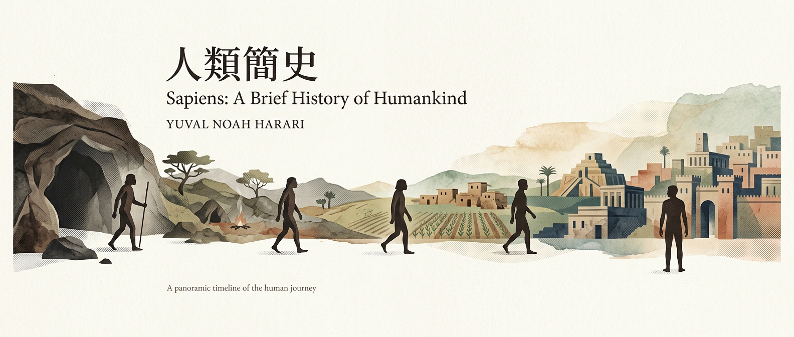<br>
      <b>提示词</b>: "为《人类简史》设计公众号封面"<br>
      <i>→ AI选择了文艺风：柔和水彩质感、人类进化全景时间线</i>
    </td>
    <td width="50%">
      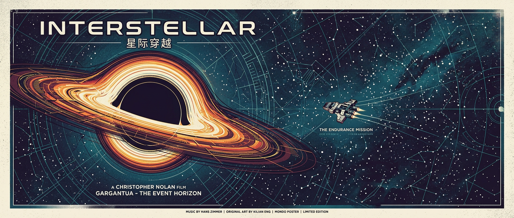<br>
      <b>提示词</b>: "为《星际穿越》影评设计公众号封面"<br>
      <i>→ AI选择了 Kilian Eng 几何未来主义：黑洞+飞船+宇宙深空</i>
    </td>
  </tr>
</table>

### 场景2：小红书配图（3:4 竖版）

<table>
  <tr>
    <td width="50%">
      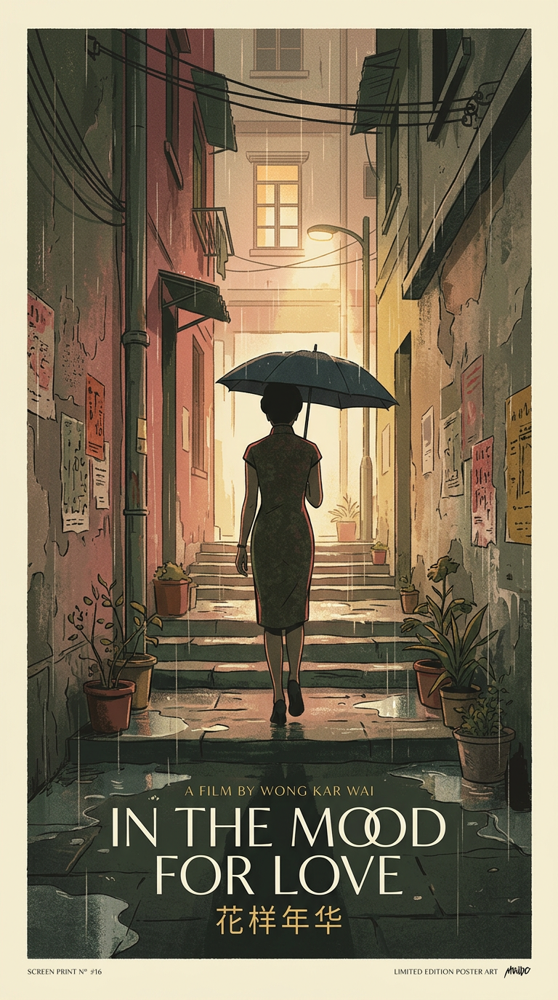<br>
      <b>提示词</b>: "为《花样年华》设计观影笔记配图"<br>
      <i>→ AI选择了日系风格：温暖胶片感、旗袍女人雨巷剪影</i>
    </td>
    <td width="50%">
      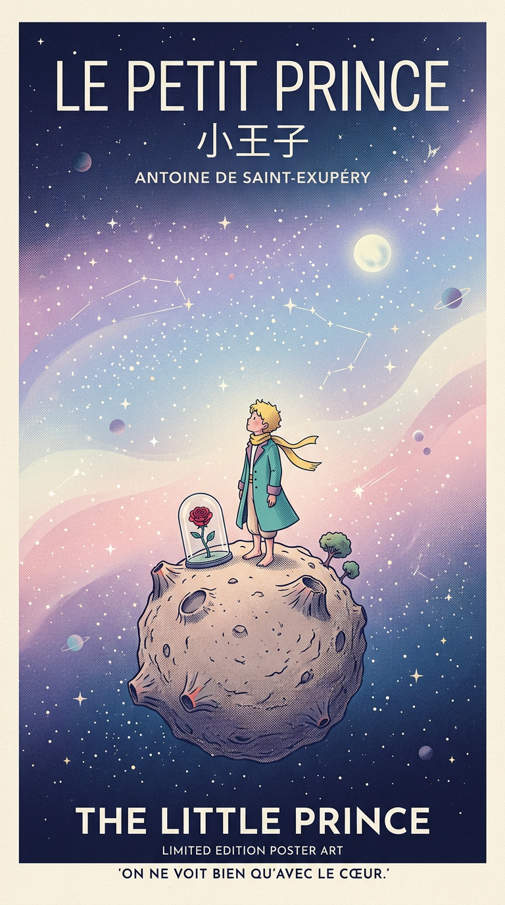<br>
      <b>提示词</b>: "为《小王子》设计读书分享配图"<br>
      <i>→ AI选择了韩系风格：梦幻粉紫渐变、小王子站在星球上</i>
    </td>
  </tr>
</table>

### 场景3：文章配图（16:9 横版）

<table>
  <tr>
    <td width="50%">
      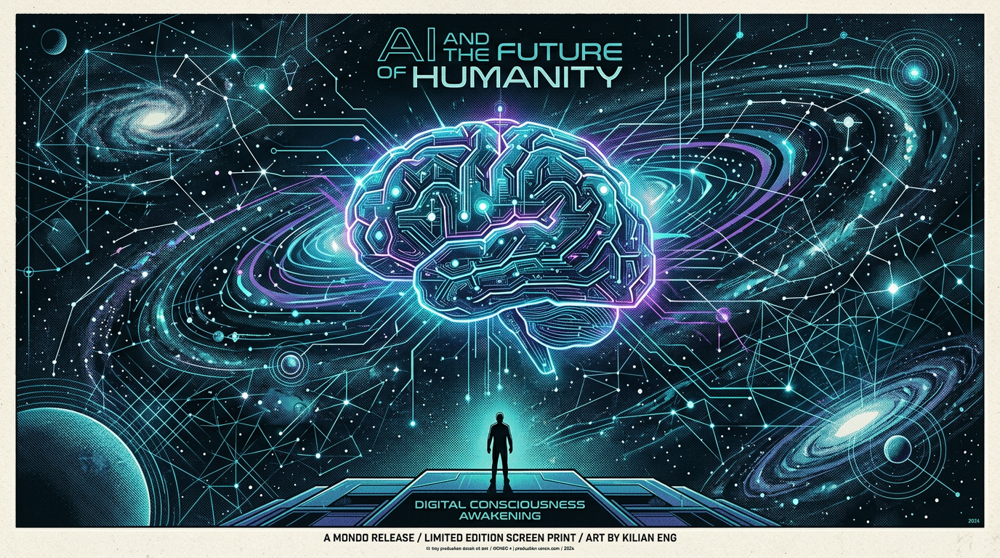<br>
      <b>提示词</b>: "为科技文章《AI与人类的未来》设计配图"<br>
      <i>→ AI选择了 Kilian Eng 未来主义：数字大脑融合宇宙</i>
    </td>
    <td width="50%">
      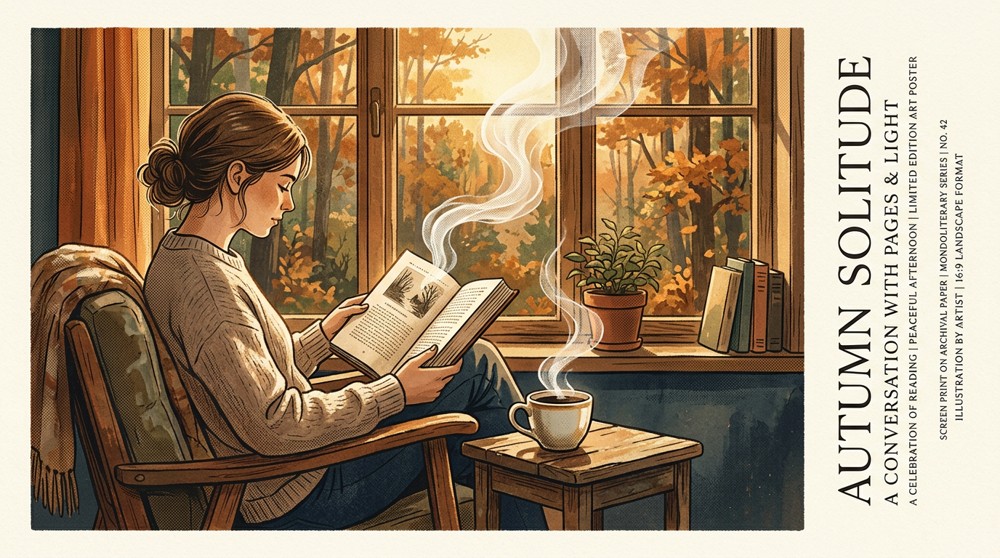<br>
      <b>提示词</b>: "为生活文章《秋日咖啡馆的午后阅读》设计配图"<br>
      <i>→ AI选择了文艺风：温暖金色光线、咖啡与书页</i>
    </td>
  </tr>
</table>

### 场景4：书籍封面设计（9:16 竖版）

<table>
  <tr>
    <td width="50%">
      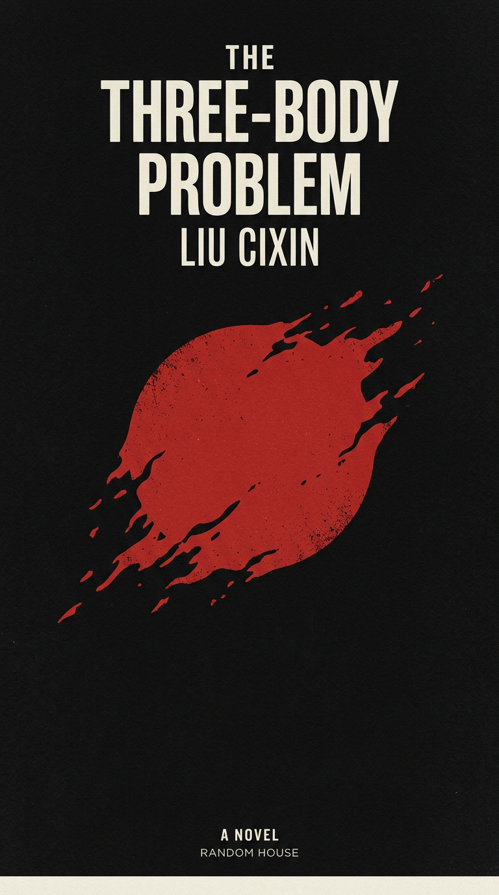<br>
      <b>提示词</b>: "为《三体》设计书籍封面"<br>
      <i>→ AI选择了 Chip Kidd 概念派：黑色虚空中一个被扭曲的红色太阳</i>
    </td>
    <td width="50%">
      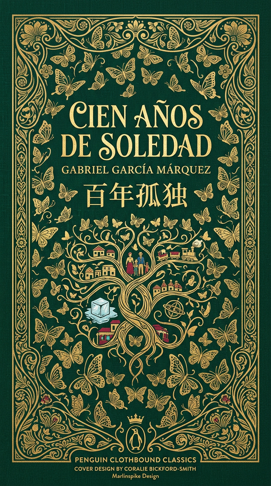<br>
      <b>提示词</b>: "为《百年孤独》设计精装书封面"<br>
      <i>→ AI选择了 Penguin Clothbound 经典风格：翡翠绿底+金色蝴蝶纹样</i>
    </td>
  </tr>
</table>

### 场景5：专辑封面设计（1:1 正方形）

<table>
  <tr>
    <td width="33%">
      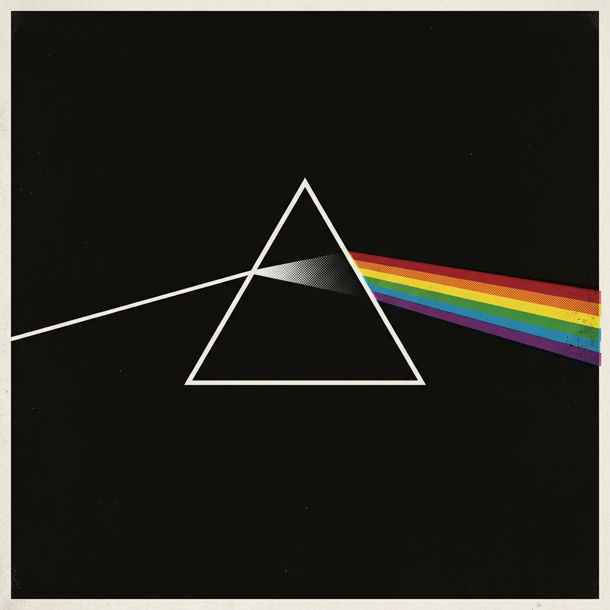<br>
      <b>Pink Floyd</b><br>
      <i>The Dark Side of the Moon</i><br>
      <i>→ Peter Saville 极简：棱镜分光彩虹</i>
    </td>
    <td width="33%">
      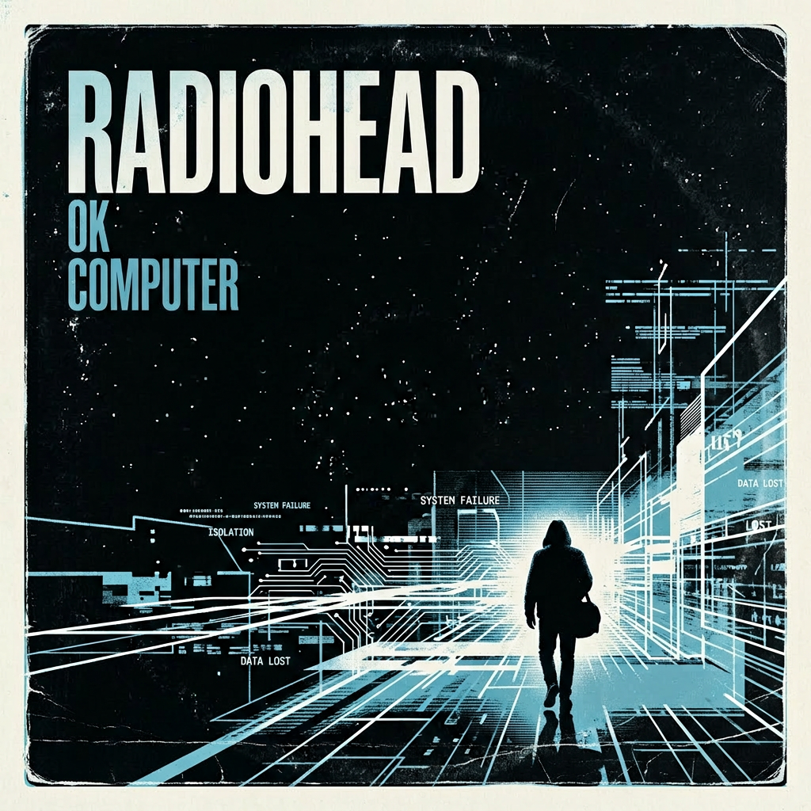<br>
      <b>Radiohead</b><br>
      <i>OK Computer</i><br>
      <i>→ Reid Miles 高对比：数字荒原孤独身影</i>
    </td>
    <td width="33%">
      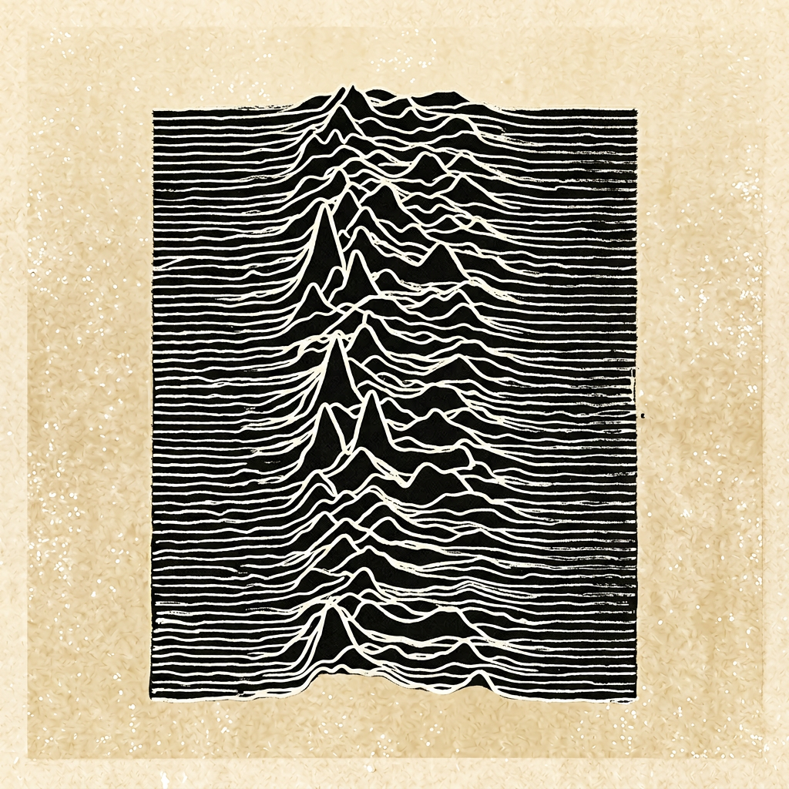<br>
      <b>Joy Division</b><br>
      <i>Unknown Pleasures</i><br>
      <i>→ David Stone Martin 极简：脉冲波形线条</i>
    </td>
  </tr>
</table>

### 场景6：活动海报 / 朋友圈分享（9:16 竖版）

<table>
  <tr>
    <td width="50%">
      <br>
      <b>提示词</b>: "为周末观影会设计海报"<br>
      <i>→ AI选择了 Saul Bass 极简几何，胶片与爆米花</i>
    </td>
    <td width="50%">
      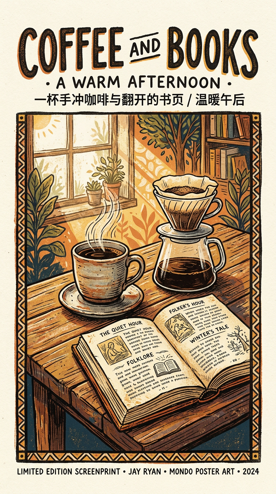<br>
      <b>提示词</b>: "为咖啡与书的午后设计海报"<br>
      <i>→ AI选择了 Jay Ryan 民间手工风格，手冲咖啡与翻开的书页</i>
    </td>
  </tr>
</table>

### 经典电影海报（IMDB Top 10）

<table>
  <tr>
    <td width="20%">
      <br>
      <b>肖申克的救赎</b><br>
      <i>负空间，铁栏中飞出自由之鸟</i>
    </td>
    <td width="20%">
      <br>
      <b>教父</b><br>
      <i>极简主义，操控之手</i>
    </td>
    <td width="20%">
      <br>
      <b>黑暗骑士</b><br>
      <i>视觉双关，蝙蝠中的小丑</i>
    </td>
    <td width="20%">
      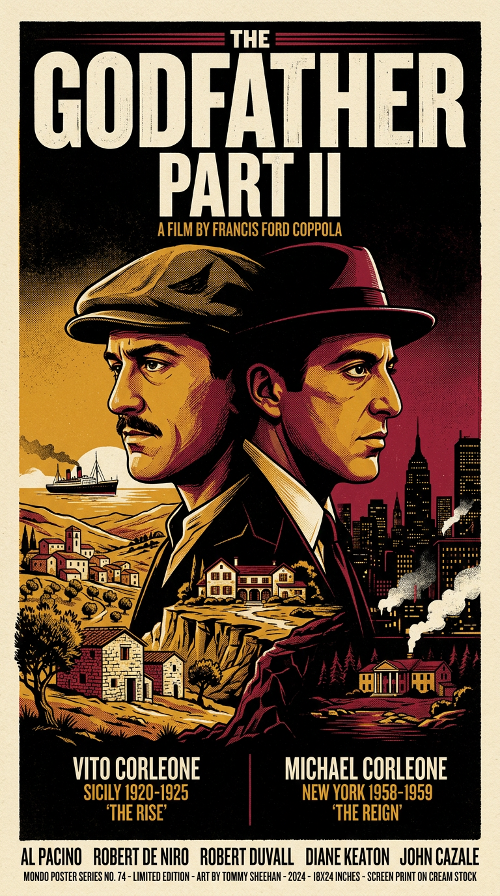<br>
      <b>教父2</b><br>
      <i>暗影传承，父与子</i>
    </td>
    <td width="20%">
      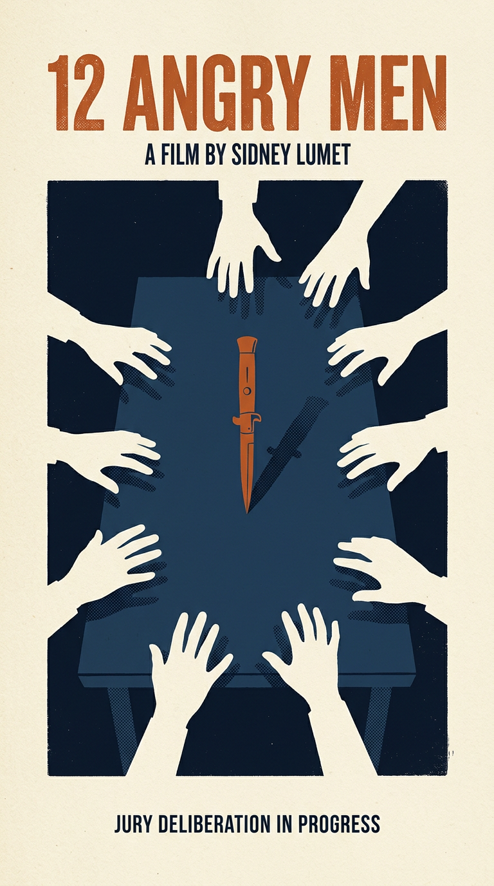<br>
      <b>十二怒汉</b><br>
      <i>极简几何，十二把椅子</i>
    </td>
  </tr>
  <tr>
    <td width="20%">
      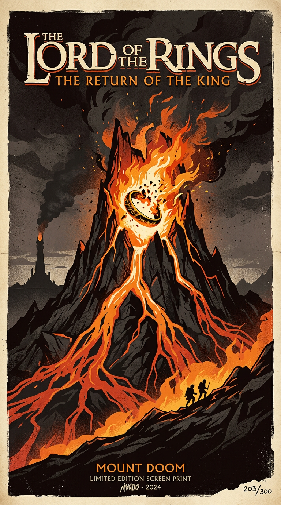<br>
      <b>指环王：王者归来</b><br>
      <i>史诗对比，至尊魔戒</i>
    </td>
    <td width="20%">
      <br>
      <b>辛德勒的名单</b><br>
      <i>黑白中的红色，生命之光</i>
    </td>
    <td width="20%">
      <br>
      <b>指环王：护戒使者</b><br>
      <i>奇幻冒险，九人远征</i>
    </td>
    <td width="20%">
      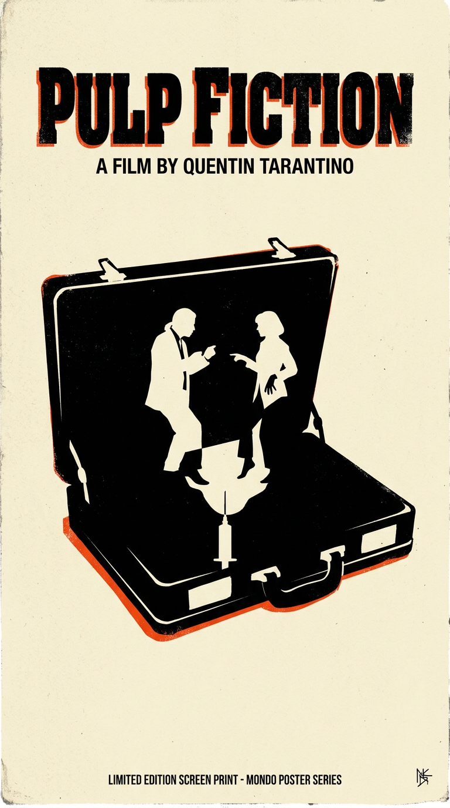<br>
      <b>低俗小说</b><br>
      <i>波普拼贴，非线性叙事</i>
    </td>
    <td width="20%">
      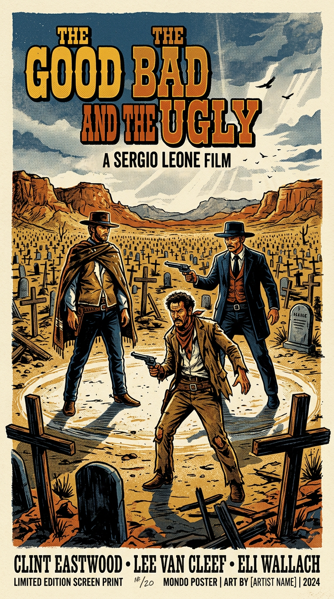<br>
      <b>黄金三镖客</b><br>
      <i>西部对峙，三人剪影</i>
    </td>
  </tr>
</table>

---

## 🎯 支持的平台和比例

| 平台 / 用途 | 推荐比例 | 命令行参数 | 说明 |
|------------|---------|-----------|------|
| 📱 **公众号封面** | 21:9 | `--aspect-ratio 21:9` | 超宽横版，适合文章头图 |
| 📕 **小红书配图** | 3:4 | `--aspect-ratio 3:4` | 竖版，小红书最常见比例 |
| 📝 **文章配图** | 16:9 | `--aspect-ratio 16:9` | 横版，适合博客/知乎/Medium |
| 📚 **书籍封面** | 9:16 | `--aspect-ratio 9:16`（默认） | 竖版，经典书籍比例 |
| 🎵 **专辑封面** | 1:1 | `--aspect-ratio 1:1` | 正方形，Spotify/网易云标准 |
| 🎭 **活动海报** | 9:16 | `--aspect-ratio 9:16`（默认） | 竖版，手机展示最佳 |
| 🎬 **电影海报** | 9:16 | `--aspect-ratio 9:16`（默认） | 竖版，经典海报比例 |
| 🖥️ **桌面壁纸** | 16:9 | `--aspect-ratio 16:9` | 横版，电脑桌面 |

---

## 🤖 AI自动帮你做什么？

你只需要描述**内容**，AI会自动：

### 1. 自动选择最合适的艺术风格

| 你说的内容类型 | AI自动选择的风格 | 为什么 |
|--------------|----------------|-------|
| 📱 公众号读书笔记 | **文艺风** 柔和留白水彩 | 诗意氛围适合深度阅读 |
| 📕 小红书观影笔记 | **日系风** 胶片感温暖色调 | 温暖质感适合生活美学 |
| 📕 小红书读书分享 | **韩系风** 梦幻粉彩渐变 | 清新梦幻适合书籍分享 |
| 📚 书籍封面（文学） | **Penguin Clothbound** 经典纹样 | 出版级精装书美学 |
| 📚 书籍封面（科幻） | **Chip Kidd** 概念派视觉隐喻 | Random House 级别设计 |
| 🎵 专辑封面 | **Peter Saville / Reid Miles** | 传奇唱片公司美学 |
| 🎬 科幻电影海报 | **Kilian Eng** 几何未来主义 | 精准技术线条 |
| 🎬 文艺电影海报 | **Alphonse Mucha** 新艺术 | 流动曲线东方美学 |
| 🎬 悬疑电影海报 | **Olly Moss** 负空间 | 隐藏意象制造神秘感 |
| 🎭 活动海报 | **Saul Bass** 极简几何 | 大胆抽象一目了然 |

你不需要知道这些艺术家是谁，AI会根据你的描述自动匹配！

### 2. 自动配色

AI会根据题材选择**大师级配色方案**：
- 科幻片 → 赛博蓝+霓虹粉
- 文艺片 → 米色+深红
- 悬疑片 → 暗黑色+血橙色
- 温情片 → 暖黄+柔蓝

### 3. 自动构图

AI懂得专业设计原则：
- **负空间** - 让留白说话
- **视觉双关** - 一个图形传递两层意思
- **极简主义** - 用最少的元素传递最强的信息
- **戏剧性对比** - 大小对比营造情感冲击

### 4. 自动适配平台比例

根据用途自动匹配最佳比例：
- 公众号封面 → **21:9** 超宽横版
- 小红书配图 → **3:4** 竖版
- 文章配图 → **16:9** 横版
- 书籍封面 → **9:16** 竖版
- 专辑封面 → **1:1** 正方形

---

## 🆚 和其他工具比有什么不同？

| 功能 | 普通AI生图 | 在线模板 | **乔木 Mondo 设计** |
|------|----------|----------|-------------------|
| 需要懂设计 | ❌ 需要写复杂提示词 | ✅ 但只能用模板 | ✅ **一句话就够** |
| 风格统一性 | ❌ 每次风格不稳定 | ⚠️ 模板固定 | ✅ **AI选择匹配风格** |
| 艺术性 | ⚠️ 看运气 | ❌ 很业余 | ✅ **大师级艺术风格** |
| 个性化 | ✅ 自由度高 | ❌ 很难改 | ✅ **AI优化你的想法** |
| 多平台适配 | ❌ 手动调整比例 | ⚠️ 有限模板 | ✅ **自动适配各平台比例** |
| 适合新手 | ❌ 需要学习 | ✅ 但千篇一律 | ✅ **零门槛+独特性** |

---

## 🎨 背后的秘密（选读）

### 什么是"Mondo"风格？

Mondo 是美国一家传奇海报公司，他们为经典电影设计**限量版丝网印刷海报**，被全球收藏家疯抢。

**Mondo海报的特点：**
- 🎨 **艺术化重新诠释** - 不是电影剧照，而是概念化的视觉提炼
- 🖨️ **丝网印刷美学** - 2-5种颜色，平面色块，复古质感
- 🎯 **极简主义象征** - 一个符号传递整部电影的精神
- ✍️ **手绘字体** - 复古装饰艺术影响
- 🌈 **大胆配色** - 高饱和度，强烈对比

### 背后有哪些艺术大师？

这个工具集成了**33+位传奇设计师**的艺术风格：

#### 电影海报界传奇（20位）
- **Saul Bass** - 希区柯克御用设计师，极简几何
- **Olly Moss** - 负空间大师，巧妙视觉双关
- **Drew Struzan** - 《星球大战》《夺宝奇兵》御用，史诗绘画风格
- **Kilian Eng** - 几何未来主义，适合科幻题材

#### 书籍封面大师（6位）
- **Chip Kidd** - Random House 首席设计师，概念派视觉隐喻
- **Coralie Bickford-Smith** - Penguin Clothbound 经典纹样
- **王志弘** - 东亚书籍设计，克制优雅

#### 专辑封面传奇（3位）
- **Peter Saville** - Factory Records，Joy Division/New Order 封面设计
- **Reid Miles** - Blue Note Records，爵士乐黄金时代
- **David Stone Martin** - Verve Records，极简水墨线条

#### 社交媒体风格（4种）
- **文艺风** - 柔和留白，诗意氛围
- **日系风** - 胶片感，温暖自然
- **韩系风** - 梦幻粉彩，清新渐变
- **国潮风** - 传统元素，现代演绎

**你不需要记住这些名字**，AI会自动为你选择最合适的风格！

---

## 🚀 进阶功能（想探索更多？）

### 1. 对比三种风格（哪个更好看？）

```bash
"用三种不同风格为《沙丘》设计海报，让我对比一下"
```

AI会生成三种艺术风格并排对比，帮你选择最喜欢的。

### 2. 自己指定风格（如果你有想法）

```bash
"用 Saul Bass 极简几何风格为《教父》设计海报"
"用 Alphonse Mucha 新艺术运动风格为《花样年华》设计海报"
```

### 3. 自定义配色（如果你对颜色有要求）

```bash
"为爵士音乐节设计海报，用橙色、深蓝色和金色"
```

### 4. 指定平台比例

```bash
"为《人类简史》设计公众号封面，21:9 比例"
"为《小王子》设计小红书配图，3:4 比例"
"为文章《AI的未来》生成 16:9 配图"
```

### 5. 让AI优化你的想法

```bash
"为《三体》设计书籍封面，我想表现宇宙的浩瀚感，用AI帮我优化提示词"
```

AI会在保留你核心想法的基础上，添加专业的设计元素。

---

## 💻 命令行快速上手（可选）

如果你喜欢用命令行：

```bash
# 公众号封面（21:9 超宽横版）
python3 ~/.claude/skills/qiaomu-mondo-poster-design/scripts/generate_mondo_enhanced.py "人类简史" book --style wenyi --aspect-ratio 21:9

# 小红书配图（3:4 竖版）
python3 ~/.claude/skills/qiaomu-mondo-poster-design/scripts/generate_mondo_enhanced.py "花样年华" movie --style rixi --aspect-ratio 3:4

# 文章配图（16:9 横版）
python3 ~/.claude/skills/qiaomu-mondo-poster-design/scripts/generate_mondo_enhanced.py "AI与未来" movie --style kilian-eng --aspect-ratio 16:9

# 书籍封面（默认 9:16 竖版）
python3 ~/.claude/skills/qiaomu-mondo-poster-design/scripts/generate_mondo_enhanced.py "三体" book --style chip-kidd

# 专辑封面（1:1 正方形）
python3 ~/.claude/skills/qiaomu-mondo-poster-design/scripts/generate_mondo_enhanced.py "Dark Side of the Moon" album --style peter-saville --aspect-ratio 1:1

# AI增强提示词
python3 ~/.claude/skills/qiaomu-mondo-poster-design/scripts/generate_mondo_enhanced.py "银翼杀手" movie --ai-enhance

# 三栏风格对比
python3 ~/.claude/skills/qiaomu-mondo-poster-design/scripts/generate_mondo_enhanced.py "盗梦空间" movie --compare saul-bass,olly-moss,kilian-eng

# 查看所有33+种风格
python3 ~/.claude/skills/qiaomu-mondo-poster-design/scripts/generate_mondo_enhanced.py --list-styles
```

---

## 📚 更多资料

- [SKILL.md](SKILL.md) - 完整技术文档
- [references/artist-styles.md](references/artist-styles.md) - 33+位设计师风格详解
- [references/genre-templates.md](references/genre-templates.md) - 各类型模板参考
- [requirements.txt](requirements.txt) - 依赖包列表

---

## ❓ 常见问题

### Q: 我完全不懂设计，真的能用吗？
**A:** 当然可以！这个工具就是为"完全不懂设计"的人准备的。你只需要用一句话描述你想要什么，剩下的全部交给AI。

### Q: 生成的图可以商用吗？
**A:** 可以。AI生成的图像可以用于个人和商业用途（具体取决于你使用的AI模型的许可协议）。

### Q: 我不喜欢AI自动选的风格怎么办？
**A:** 你可以让AI"对比三种风格"，然后选择你喜欢的。或者直接指定风格，比如"用极简风格"、"用复古风格"。

### Q: 不同平台的比例怎么选？
**A:** 直接告诉AI你要用在哪个平台即可！比如"公众号封面"会自动用 21:9，"小红书配图"会自动用 3:4。也可以手动指定比例。

### Q: 可以修改已有的图片吗？
**A:** 可以！这叫"图生图"功能，你可以把现有的照片或海报转换成Mondo艺术风格。

### Q: 需要安装什么软件吗？
**A:** 需要安装Python 3.7+，以及设置AI Gateway API Key。详细安装步骤看SKILL.md。

---

## 🎁 最后

设计不应该是少数人的特权。
好的工具应该让**每个人**都能轻松创作出专业级作品。

**如果这个工具帮到了你，欢迎分享给更多朋友！**

---

## 📱 关注作者

- **X (Twitter)**: [@vista8](https://x.com/vista8)
- **微信公众号「向阳乔木推荐看」**:

<p align="center">
  
</p>

---

**由 [Claude Code](https://claude.com/claude-code) 提供支持**
