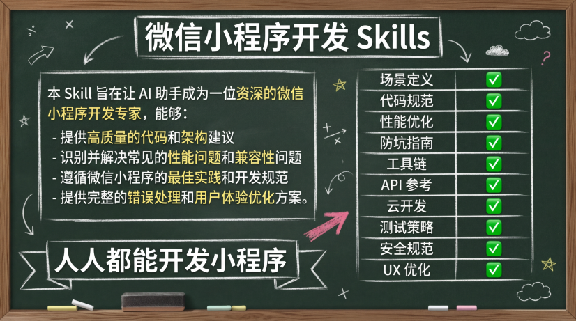

# 微信小程序开发 Skills

[](https://opensource.org/licenses/MIT)
[](https://github.com/your-repo/wechat-miniprogram-skill)



一个专为 AI 编程助手设计的微信小程序开发技能包，提供全面的开发指导、性能优化和最佳实践。

## 📌 简介

本 Skill 旨在让 AI 助手成为一位资深的微信小程序开发专家，能够：
- 提供高质量的代码和架构建议
- 识别并解决常见的性能问题和兼容性问题
- 遵循微信小程序的最佳实践和开发规范
- 提供完整的错误处理和用户体验优化方案

## ✨ 特性

### 🎯 场景定义清晰
- 明确定义何时使用和何时不使用此 Skill
- 避免与其他开发场景（Web、H5、原生应用）混淆
- 提供清晰的关键词触发机制

### ⚡ 性能优化深入
- **setData 优化**: 使用数据路径进行局部更新，避免全量更新
- **渲染优化**: 长列表虚拟化、图片懒加载、分包加载
- **代码体积控制**: 主包 < 2MB，总包 < 20MB

### 🛡️ 兼容性保障
- iOS/Android 双端兼容性处理
- 日期格式、键盘遮挡等常见问题解决方案
- 基础库版本检查和降级方案

### 📚 知识覆盖全面
- 项目结构与配置
- 开发规范（命名、代码风格）
- API 使用指南
- 云开发集成
- 测试与发布流程

### 🚀 创新补充
- 完整的测试策略
- 安全规范（数据加密、XSS 防护）
- 用户体验优化（骨架屏、加载反馈）
- 错误处理和监控

## 📦 安装使用

### 方式一：直接使用（推荐）

将 `SKILL.md` 文件内容复制到你的 AI 编程助手的技能配置中即可。

### 方式二：通过 Git 引用

```bash
# 克隆仓库
git clone https://github.com/your-repo/wechat-miniprogram-skill.git

# 将 SKILL.md 添加到你的 AI 助手配置中
```

### 方式三：npm 安装（如果你的 AI 助手支持）

```bash
npx add-skill https://github.com/your-repo/wechat-miniprogram-skill
```

## 🎓 使用示例

### 示例 1：创建标准项目结构

**用户提问**：
> 帮我创建一个微信小程序项目，包含用户登录和商品列表功能

**AI 回答**（使用本 Skill 后）：
- 创建标准的项目目录结构
- 配置 `app.json` 和 `project.config.json`
- 实现性能优化的登录流程
- 提供商品列表的虚拟滚动实现
- 包含完整的错误处理和用户反馈

### 示例 2：性能优化指导

**用户提问**：
> 我的小程序列表滚动很卡顿，怎么优化？

**AI 回答**（使用本 Skill 后）：
- 分析 setData 使用情况，提供数据路径更新方案
- 建议使用虚拟列表组件
- 检查图片加载方式，建议使用懒加载
- 提供具体的代码优化示例

### 示例 3：兼容性问题解决

**用户提问**：
> 日期显示在 iOS 上不正常，显示 Invalid Date

**AI 回答**（使用本 Skill 后）：
- 识别为 iOS 日期格式兼容性问题
- 提供将 `2024-03-31` 转换为 `2024/03/31` 的解决方案
- 提供封装好的日期处理工具函数

## 📖 核心内容

### 1. 开发原则

- **性能优先**: 优化 setData、减少渲染、控制包体积
- **原生兼容**: iOS/Android 双端一致性
- **代码质量**: 模块化、可维护、可测试
- **用户体验**: 快速响应、友好反馈
- **安全规范**: 数据加密、权限控制

### 2. 技术栈支持

- ✅ 原生开发（JavaScript/TypeScript）
- ✅ 跨平台框架（Taro/Uni-app）
- ✅ 云开发（微信云开发/CloudBase）
- ✅ 构建工具（微信开发者工具/miniprogram-ci）

### 3. 项目结构

```
miniprogram/
├── app.js                 # 小程序入口
├── app.json              # 全局配置
├── app.wxss              # 全局样式
├── pages/                # 页面
├── components/           # 组件
├── utils/                # 工具函数
├── api/                  # API 定义
├── assets/               # 静态资源
└── cloud/                # 云函数
```

### 4. 开发规范

- **命名规范**: kebab-case、camelCase、BEM
- **代码规范**: 箭头函数、async/await、解构赋值
- **组件化**: 优先使用 Component 构造器
- **样式规范**: 使用 rpx、BEM 命名

### 5. 性能优化重点

#### setData 优化
```javascript
// ✅ 推荐：局部更新
this.setData({
  'userInfo.nickName': 'New Name',
  'list[0].status': 'completed'
})

// ❌ 避免：全量更新
this.setData({
  userInfo: { ...this.data.userInfo, nickName: 'New Name' }
})
```

#### 长列表优化
- 使用虚拟列表（recycle-view）
- 分页加载
- 图片懒加载

#### 分包加载
- 主包：核心功能 < 2MB
- 分包：低频功能 < 2MB
- 独立分包：可独立运行

### 6. 常见问题防坑

#### iOS 日期格式
```javascript
// ❌ iOS 不支持
new Date('2024-03-31')

// ✅ 兼容写法
new Date('2024/03/31')
```

#### 页面栈限制（最大 10 层）
```javascript
const pages = getCurrentPages()
if (pages.length >= 10) {
  wx.redirectTo({ url: '/pages/target/target' })
} else {
  wx.navigateTo({ url: '/pages/target/target' })
}
```

#### 原生组件层级
```xml
<video src="{{videoUrl}}">
  <cover-view class="controls">
    <cover-image src="/images/play.png" />
  </cover-view>
</video>
```

## 🔧 API 使用指南

### 网络请求封装
```javascript
import request from '@/utils/request'

// GET 请求
const data = await request.get('/api/user/info')

// POST 请求
const result = await request.post('/api/user/update', {
  nickName: 'New Name'
})
```

### 用户授权
```javascript
import permission from '@/utils/permission'

const hasPermission = await permission.check('scope.userLocation')
if (hasPermission) {
  wx.getLocation({ ... })
}
```

### 云开发
```javascript
// 云函数调用
const result = await wx.cloud.callFunction({
  name: 'getUser',
  data: { userId: 123 }
})

// 云数据库
const db = wx.cloud.database()
const { data } = await db.collection('todos')
  .where({ status: 'active' })
  .get()
```

## 📊 性能指标

- 首屏渲染时间: < 2s
- setData 单次数据: < 1024KB
- 代码包总大小: < 20MB
- 主包大小: < 2MB
- 单个分包: < 2MB
- 页面栈深度: ≤ 10 层

## 🤝 贡献

欢迎提交 Issue 和 Pull Request 来改进这个 Skill！

### 贡献指南

1. Fork 本仓库
2. 创建你的特性分支 (`git checkout -b feature/AmazingFeature`)
3. 提交你的更改 (`git commit -m 'Add some AmazingFeature'`)
4. 推送到分支 (`git push origin feature/AmazingFeature`)
5. 打开一个 Pull Request

## 📄 许可证

本项目采用 MIT 许可证 - 查看 [LICENSE](LICENSE) 文件了解详情。

## 🙏 致谢

本 Skill 的设计参考了以下优秀项目：
- [TencentCloudBase/skills](https://github.com/TencentCloudBase/skills) - 企业级云开发集成
- [gourdbaby/wechat-miniprogram-skill](https://github.com/gourdbaby/wechat-miniprogram-skill) - 性能优化实践
- [joneqian/claude-skills-suite](https://github.com/joneqian/claude-skills-suite) - 全面的文档覆盖

感谢这些项目为社区做出的贡献！

### 相比参考示例的优势

| 维度 | TencentCloudBase | gourdbaby | joneqian | **本 Skill** |
|------|------------------|-----------|----------|------------|
| 场景定义 | ✅ | ⚠️ | ⚠️ | ✅ |
| 代码规范 | ❌ | ✅ | ⚠️ | ✅ |
| 性能优化 | ❌ | ✅ | ⚠️ | ✅ |
| 防坑指南 | ❌ | ✅ | ❌ | ✅ |
| 工具链 | ✅ | ❌ | ⚠️ | ✅ |
| API 参考 | ❌ | ❌ | ✅ | ✅ |
| 云开发 | ✅ | ❌ | ⚠️ | ✅ |
| 测试策略 | ❌ | ❌ | ❌ | ✅ |
| 安全规范 | ❌ | ❌ | ❌ | ✅ |
| UX 优化 | ❌ | ⚠️ | ❌ | ✅ |

## 📞 联系方式

- 项目主页: [https://github.com/your-repo/wechat-miniprogram-skill](https://github.com/your-repo/wechat-miniprogram-skill)
- 问题反馈: [Issues](https://github.com/your-repo/wechat-miniprogram-skill/issues)

## 🔗 相关资源

- [微信官方文档](https://developers.weixin.qq.com/miniprogram/dev/framework/)
- [小程序开发者社区](https://developers.weixin.qq.com/community/)
- [云开发文档](https://developers.weixin.qq.com/miniprogram/dev/wxcloud/basis/getting-started.html)
- [性能优化指南](https://developers.weixin.qq.com/miniprogram/dev/framework/performance/)

---

**如果这个 Skill 对你有帮助，请给一个 ⭐️ Star！**
